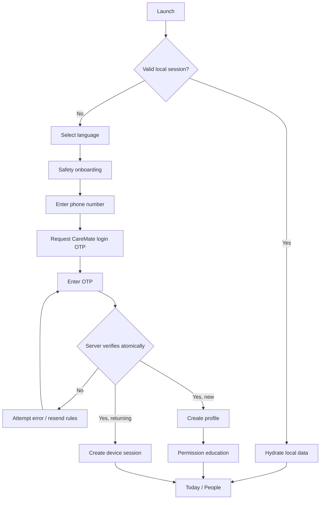
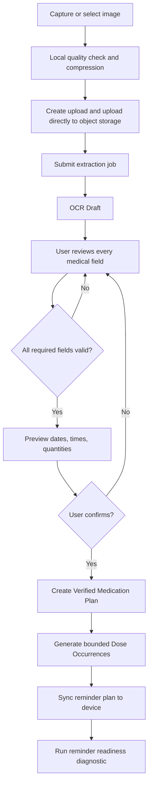
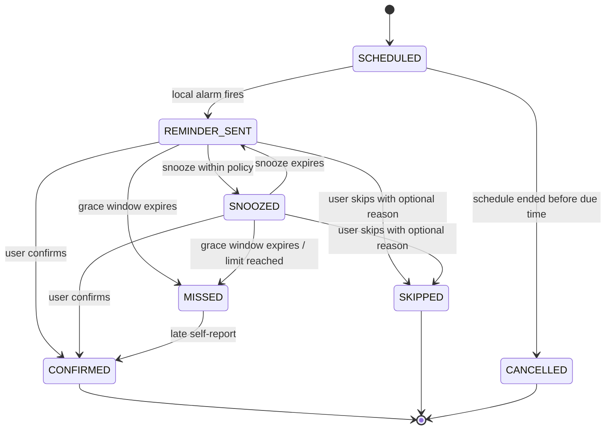
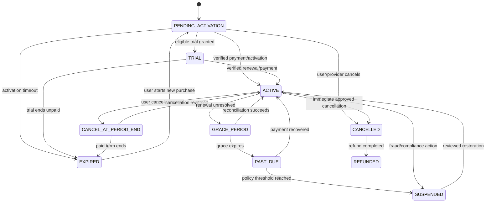
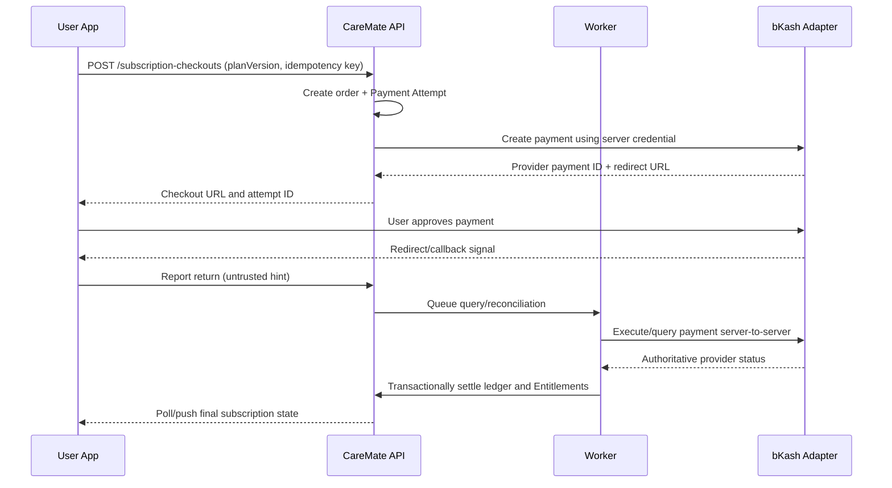
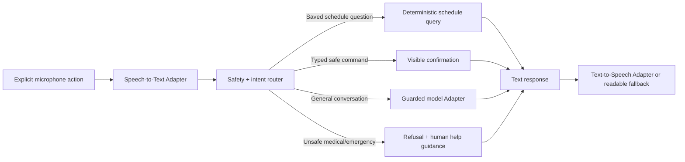
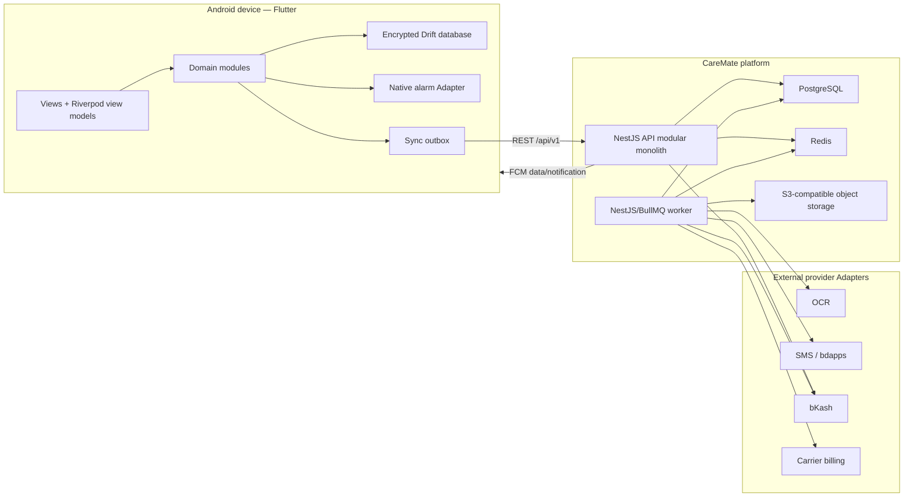

# CareMate — Complete Product and Technical Specification

**Document status:** Implementation baseline  
**Version:** 1.0  
**Date:** 16 August 2026  
**Primary market:** Bangladesh  
**Initial client:** Android application built with Flutter  
**Languages:** Bangla and English  
**Research basis:** [CareMate Research Evidence](./CareMate_RESEARCH_EVIDENCE.md) and [CareMate Discovery Report](./CareMate_DISCOVERY_REPORT.md)

> CareMate is a medication-support product, not a medical device, diagnosis service, prescribing system, or emergency service. A User confirmation is a self-report; the product must never claim that medicine was swallowed.

## 1. Executive specification

CareMate helps a Patient Profile turn a photographed or manually entered prescription into a confirmed medication plan, receive dependable on-device reminders, report a dose outcome, track estimated stock, and—when explicit consent exists—notify a Caregiver after a missed dose. Premium capabilities add expanded caregiving, reports, optional voice assistance, and partner-backed delivery channels.

The implementation is an offline-capable Flutter client backed by a NestJS modular monolith, a separate asynchronous worker, PostgreSQL, Redis/BullMQ, S3-compatible object storage, Firebase Cloud Messaging (FCM), a provider-neutral SMS Interface, a bKash Payment Adapter, and an optional bdapps Carrier Billing Adapter. All external integrations are behind narrow Interfaces so demo and unapproved provider behavior cannot contaminate core medication logic.

### 1.1 Release decision

The product is a **conditional build-and-pilot**, not an unconditional public launch. The reminders, confirmation, caregiver, inventory, and offline paths can be built now. Production SMS, bdapps subscription charging, and bKash recurring behavior remain gated by written provider/commercial approval and an end-to-end sandbox/certification pass.

### 1.2 Product promise

“CareMate helps you follow a medicine plan and keeps trusted family informed when you ask it to.”

### 1.3 Non-negotiable outcomes

1. Medication reminders continue without network access after a plan has synced to the device.
2. OCR output never activates a schedule until the User reviews and confirms it.
3. The server rejects illegal or duplicated dose transitions, payment transitions, and sync commands.
4. Caregiver access is explicit, granular, revocable, and auditable.
5. Payment provider responses and client redirects never grant Entitlements on their own.
6. Demo Mode is visible and cannot send real SMS, charge money, or mix with production records.
7. Every safety-relevant screen works in Bangla and English and at large text sizes.

### 1.4 Success measures for a pilot

- At least 90% of valid confirmed schedules produce the expected local reminder in the device test matrix.
- At least 80% of moderated participants can add and confirm a medication plan without facilitator correction.
- Zero unconfirmed OCR Drafts create active Dose Occurrences.
- Zero duplicate inventory decrements or duplicate charges in retry/idempotency tests.
- Caregiver access revocation takes effect server-side immediately and locally after the next sync.
- App-based Adherence Indicator is always labeled as self-reported/app-based.
- Production launch requires the research go/no-go gates in the Discovery Report to pass.

## 2. Scope and release boundaries

### 2.1 MVP (pilot release)

#### Identity and account

- Phone-number authentication with OTP.
- First-login account creation; returning-user login.
- Rotating device sessions, logout current device, logout all devices.
- Bangla/English onboarding and Patient Profile creation.
- Notification, exact-alarm, camera/photo, and optional microphone permission education.
- Account export and deletion request.

#### Medication plan

- Photograph or select a Prescription Image.
- Compress, orient, upload, and process the image.
- OCR Draft with field confidence and source bounding boxes where available.
- Mandatory editable review of medicine, strength, form, quantity, frequency, timing, meal relation, duration, and notes.
- Manual medication entry as a complete fallback.
- Deterministic schedule preview before activation.
- Edit, pause, resume, and end a Medication Schedule with occurrence regeneration rules.

#### Reminders and dose lifecycle

- On-device alarms/notifications scheduled ahead.
- Reminder actions: Confirm, Snooze, Skip, Open.
- Configurable snooze duration, default 10 minutes; default maximum three snoozes.
- Missed-dose evaluation after a configurable grace window.
- Late confirmation after a miss without deleting the historical miss/escalation trail.
- Device boot, timezone change, permission change, and app-update rescheduling.
- Push notification for remote caregiver alerts and non-critical updates.

#### Caregiver

- Invite by phone number or expiring link/code.
- Patient consent and Caregiver acceptance.
- Granular permissions: view schedule, view dose outcomes, receive missed alerts, manage schedule, view inventory.
- Patient-controlled revoke.
- Caregiver dashboard showing only linked Patient Profiles.
- In-app and push escalation; SMS only through an approved transactional Adapter.

#### Inventory and insights

- Opening quantity and restock Stock Adjustments.
- Idempotent decrement on first valid confirmation only.
- Estimated days remaining and low-stock threshold.
- Daily/weekly app-based adherence summary with numerator and denominator explanation.
- Exportable basic report.

#### Reliability and operations

- Offline read/write for core medication actions.
- Command-based sync with conflict handling.
- Demo Mode with seeded personas and fake providers.
- Admin operations for support lookup, consent/audit inspection, provider event replay, and feature/configuration controls.

### 2.2 Phase 2

- Multiple Caregivers per Patient Profile with permission templates.
- Multiple Patient Profiles managed by one Caregiver.
- CareBuddy child experience and elderly simplified mode.
- Local Bangla/English Text-to-Speech reminders when device language support exists.
- Optional conversational companion limited to reminders, orientation, and non-clinical support.
- Advanced trends, monthly reports, refill forecasting, and clinician-shareable PDF.
- bKash paid plans after merchant certification.
- Robi/bdapps carrier subscriptions after written commercial approval.
- Tokenized/recurring payment only after explicit bKash product approval.
- Sleep-aware reminder preferences that never silently suppress a prescribed schedule.

### 2.3 Future—not committed

- Clinician portal, verified pharmacy fulfillment, national medicine catalogue, wearables, iOS, organization accounts, insurer/employer programs, and regulated clinical decision support.

### 2.4 Explicit exclusions

- Diagnosing a condition or assessing symptom severity.
- Recommending, prescribing, changing, or stopping medicine.
- Drug interaction, contraindication, or dosage correctness claims unless delivered later by a separately validated clinical system.
- Automatic activation from OCR without User confirmation.
- Claiming a dose was ingested.
- Treating reminder silence, missing device connectivity, or missed confirmation as proof of a medical emergency.
- Using bdapps subscription OTP as CareMate login OTP without written provider authorization.
- Sending production caregiver SMS or charging a subscriber from Demo Mode.

## 3. Actors, roles, and authorization

### 3.1 Actors

| Actor | Goal | Primary capabilities |
|---|---|---|
| User | Access CareMate securely | Authenticate, manage sessions, privacy, language |
| Self-managing Patient | Follow their own plan | Confirm plan, receive reminders, report outcome, manage sharing |
| Assisted Patient | Receive support | Same patient capabilities with optional Caregiver assistance |
| Caregiver | Support one or more people | View granted data, receive alerts, optionally manage schedules |
| Support Operator | Resolve account/provider issues | Restricted lookup, event inspection, no silent medical edits |
| Operations Administrator | Operate platform | Configuration, provider health, entitlements, audited grants |
| External Provider | Deliver a bounded capability | OCR, SMS, push, payment, carrier billing, storage |

### 3.2 Role model

Authentication role and caregiving status are separate. A User may simultaneously own a Patient Profile and be a Caregiver for another Patient Profile.

- `USER`: baseline authenticated role.
- `SUPPORT`: scoped operations role; protected by staff identity/MFA.
- `ADMIN`: privileged operations role; protected by staff identity/MFA and stronger audit controls.
- `SYSTEM_WORKER`: machine principal for internal jobs.

Patient/Caregiver authorization is relationship-based rather than a global role. Every patient-scoped server query applies `patientProfileId + relationship permission + relationship status` checks.

### 3.3 Care Relationship permissions

| Permission | Meaning |
|---|---|
| `SCHEDULE_VIEW` | View confirmed Medications, schedules, and upcoming occurrences |
| `DOSE_OUTCOME_VIEW` | View self-reported dose outcomes and app-based indicators |
| `MISSED_ALERT_RECEIVE` | Receive permitted escalation alerts |
| `SCHEDULE_MANAGE` | Propose/create/edit/pause schedules on the Patient’s behalf |
| `INVENTORY_VIEW` | View estimated stock and low-stock state |
| `INVENTORY_MANAGE` | Add explicit Stock Adjustments |

`SCHEDULE_MANAGE` is not permission to prescribe. Every change identifies the actor, creates an audit event, and presents the resulting schedule to the Patient when the Patient controls consent.

## 4. Product navigation and screen inventory

### 4.1 Global navigation

- Patient mode: **Today**, **Medicines**, **Care**, **Insights**, **More**.
- Caregiver mode: **People**, **Alerts**, **Reports**, **More**.
- A role switcher appears only when the User has both a Patient Profile and an accepted Care Relationship.
- Deep links always pass through authentication, relationship authorization, and object-state validation.

### 4.2 Screen catalogue

#### Launch and authentication

1. Splash and local session restore
2. Language selection
3. Value/safety onboarding
4. Phone number entry (`+880` normalization)
5. OTP verification and resend countdown
6. New profile setup
7. Session/device management
8. Account recovery guidance

#### Permissions and readiness

9. Notification education and runtime request
10. Exact-alarm education/status
11. Battery/background reliability guidance where device-specific behavior requires it
12. Camera/photo permission
13. Accessibility and voice preference
14. Reminder readiness diagnostic

#### Patient

15. Today dashboard
16. Reminder/ringing experience
17. Dose detail and event history
18. Medicines list
19. Medication detail
20. Prescription capture
21. Image preview/retake
22. OCR processing
23. OCR review/editor
24. Schedule preview
25. Manual medication entry
26. Schedule edit/pause/end
27. Inventory overview
28. Stock adjustment
29. Low-stock detail
30. Insights summary
31. Report detail/export

#### Care and sharing

32. Care hub
33. Invite Caregiver
34. Pending invitations
35. Invitation accept/decline
36. Relationship permission editor
37. Escalation policy editor
38. Relationship revoke confirmation

#### Caregiver

39. People dashboard
40. Patient summary
41. Patient schedule
42. Active/missed alerts
43. Alert detail/acknowledge
44. Patient report

#### Subscription and payment

45. Plan comparison
46. Checkout method selection
47. bKash payment handoff/result
48. Robi/bdapps consent/activation status
49. Current plan and Entitlements
50. Cancel/renew/manage subscription
51. Payment history and receipt

#### Settings and support

52. Language/theme/text size
53. Reminder settings
54. Privacy and consent history
55. Data export
56. Account deletion
57. Help, safety, and emergency contacts
58. About/legal/provider disclosures
59. Demo Mode entry/reset/exit

### 4.3 Accessibility requirements

- Minimum 48dp touch targets; no outcome depends on color alone.
- Support Android font scaling through at least 200% without clipped safety content.
- Semantic labels and ordered focus for screen readers.
- Large, separated Confirm/Snooze/Skip actions with destructive-action confirmation where appropriate.
- Bangla copy is human-reviewed; numerals and time format follow the selected locale while medicine names remain faithfully editable.
- Elderly mode may simplify density and navigation but never changes the underlying medication data or consent rules.

### 4.4 Design system

Use Material 3 through centralized semantic tokens; widgets never hard-code production colors, radii, spacing, or typography.

| Token group | Baseline |
|---|---|
| Brand | `primary` deep teal, `secondary` warm blue; final values require contrast verification |
| Status | `success`, `warning`, `error`, `info` with icon/text companions |
| Surfaces | `background`, `surface`, `surfaceVariant`, `outline`, inverse variants |
| Text | `onPrimary`, `onSurface`, `mutedText`, disabled with contrast-safe opacity |
| Spacing | 4dp base scale: 4, 8, 12, 16, 24, 32, 48 |
| Radius | 8 small, 12 controls, 16 cards, 24 sheets; theme tokens only |
| Typography | Locale-tested Material scale with Bangla-capable bundled/system font and safe fallback |
| Motion | Short purposeful transitions; honor reduced-motion preference |

Reusable Interface inventory: primary/secondary/destructive buttons, medication/status cards, form fields, OTP input, segmented choice, date/time/quantity controls, dialog, bottom sheet, snackbar/banner, skeleton/loading, empty state, recoverable error, offline/pending-sync badge, status chip, and consent panel.

Every screen implements six states where relevant: initial/loading, content, empty, offline-cached, pending-sync, and recoverable/terminal error. Layout is constraint-responsive for small phones through large phones and practical tablet panes; no fixed screen widths.

### 4.5 Permission policy

Permissions are requested contextually after a plain-language explanation:

- Notifications when the User is about to enable reminders.
- Exact-alarm special access only when required and supported.
- Camera/photo access when capturing/importing a Prescription Image.
- Microphone only when the User starts an optional voice feature.
- Phone call permission is avoided by opening the dialer with an explicit User action where possible.
- CareMate does not request read/send SMS permission for provider-delivered OTP or caregiver messages.

Denial leaves a usable fallback and a readiness warning. Repeated prompts follow platform policy and never trap the User.

## 5. End-to-end application flows

### 5.1 First launch and authentication



The client never decides whether an OTP is valid and never receives a reusable SMS-provider secret. A generic request response prevents phone-number enumeration.

### 5.2 Prescription-to-reminder flow



Manual entry enters at the review step and is always available. An OCR timeout or provider failure returns the User to the image/manual options without losing the uploaded draft record.

### 5.3 Reminder, snooze, miss, and escalation



The first transition to `CONFIRMED` creates one Dose Confirmation and one inventory consumption adjustment. If confirmation follows `MISSED`, `missedAt` and prior Alert history remain; the confirmation is classified `LATE`. Previously sent alerts may be marked resolved but are never silently erased.

Escalation evaluates only after the server knows the occurrence is missed, or after a device-originated missed event syncs. The policy sequence is configurable: in-app → push → SMS. It stops if the event becomes resolved, consent is revoked, the relationship expires, the channel is unavailable, or the maximum step is reached.

### 5.4 Caregiver invitation

1. Patient enters Caregiver phone number and selects permissions/channels.
2. Server creates a single-use, expiring invitation with no medical detail in the message.
3. Existing User receives in-app/push; an approved SMS channel may deliver a neutral invitation link/code.
4. Recipient authenticates with CareMate login OTP and sees who invited them and what access is requested.
5. Recipient accepts or declines. Acceptance creates an `ACTIVE` Care Relationship.
6. Either party can end the relationship. The server immediately denies new reads; clients remove cached shared data at next sync/session event.
7. Re-invitation after revoke creates a new relationship and never resurrects prior consent silently.

### 5.5 Offline flow

1. Confirmed plan and a rolling reminder horizon are stored locally.
2. Reminder fires through the operating system without network access.
3. User action commits to encrypted local storage first with a unique mutation ID.
4. UI immediately reflects `pendingSync` and never pretends the server accepted the command.
5. WorkManager retries sync when constraints permit.
6. Server processes the mutation idempotently and returns authoritative state/version.
7. Client marks it accepted, rebases later mutations, or shows a resolvable conflict.

Connectivity status is informative, not proof that the internet works. FCM is a remote update/alert channel, not the medication alarm clock.

### 5.6 Emergency/help flow

CareMate can display configured emergency contacts and open the phone dialer. Copy must say that CareMate does not monitor emergencies and instruct Users to contact local emergency/clinical services for urgent concerns. No automated diagnosis or emergency dispatch is implied.

## 6. Authentication and OTP verification specification

### 6.1 Identity choice

The canonical login identifier is an E.164 Bangladesh mobile number. Input accepts common local forms and normalizes them server-side to `+8801XXXXXXXXX`. The displayed phone is masked except where the User is confirming an intentional change.

CareMate owns the login challenge lifecycle. `OtpDeliveryProvider` is a replaceable Interface backed by an approved transactional SMS provider. The public bdapps `/otp/request` and `/otp/verify` operations documented during research activate a bdapps subscription; they must not be reused as general CareMate authentication without written authorization. Demo and automated tests use `MockOtpAdapter` with an obvious non-production banner.

### 6.2 Request OTP

`POST /api/v1/auth/otp/requests`

Request:

```json
{
  "phoneNumber": "01700123456",
  "purpose": "LOGIN",
  "locale": "bn-BD",
  "deviceInstallationId": "019...uuidv7"
}
```

Successful public response is intentionally generic:

```json
{
  "data": {
    "challengeId": "019...uuidv7",
    "expiresInSeconds": 300,
    "resendAfterSeconds": 60,
    "deliveryHint": "••••••3456"
  },
  "meta": { "requestId": "req_..." }
}
```

Server algorithm:

1. Normalize and validate the number.
2. Apply rate limits to normalized phone, IP prefix, device installation, and abuse fingerprint.
3. Return the same shaped response whether or not an account exists.
4. Generate a cryptographically secure six-digit code. Six digits is configurable but never reduced.
5. Store only an HMAC/hash of `challengeId + code + purpose` in Redis with a five-minute TTL; never store or log plaintext OTP.
6. Record send count, verification attempt count, provider message ID, and risk metadata.
7. Enqueue delivery through the approved Adapter. Do not block the response on a delivery receipt.
8. Expire prior unused login challenge for the same phone/device, or explicitly make only the newest challenge valid.

Initial configurable controls:

| Control | Baseline |
|---|---:|
| OTP lifetime | 5 minutes |
| Resend cooldown | 60 seconds |
| Verification attempts per challenge | 5 |
| Sends per phone per hour | 5 |
| Sends per phone per 24 hours | 10 |
| Sends per device/IP | Risk-configured; stricter than phone-only controls |

Limits are operational configuration, not mobile constants. CAPTCHA/device attestation may be introduced after risk evidence; neither replaces server throttling.

### 6.3 Verify OTP

`POST /api/v1/auth/otp/verifications`

```json
{
  "challengeId": "019...uuidv7",
  "otp": "123456",
  "device": {
    "installationId": "019...uuidv7",
    "platform": "ANDROID",
    "appVersion": "1.0.0",
    "deviceName": "User-visible device label"
  }
}
```

Verification is a single atomic operation:

- Load an unused, unexpired challenge of the correct purpose.
- Increment attempts before comparison; lock/expire at the limit.
- Compare hashes in constant time.
- Mark the challenge consumed so the code cannot be replayed.
- Create the User on first login, otherwise load the existing active User.
- Create a device session and refresh-token family.
- Return a short-lived access token and a rotating opaque refresh token.

Baseline tokens:

| Credential | Format | Lifetime | Storage |
|---|---|---:|---|
| Access token | Signed JWT with `sub`, session ID, token version, audience | 15 minutes | Memory; secure storage only if process survival requires it |
| Refresh token | 256-bit opaque random value | 30 days idle; configurable absolute limit | OS secure storage; only keyed SHA-256/HMAC lookup hash server-side |
| Staff session | Separate identity provider/MFA | Organization policy | Separate admin origin and cookie/token policy |

### 6.4 Refresh, rotation, and reuse detection

`POST /api/v1/auth/token/refresh` accepts the current refresh token. Within one transaction, it revokes that token, issues the next token in the family, and returns a new access token. Reuse of a rotated token revokes the entire family and emits a security event. Concurrent legitimate refreshes are serialized or given a very small grace mechanism that cannot produce two durable child tokens.

`POST /api/v1/auth/logout` revokes the current session. `POST /api/v1/auth/logout-all` increments the User token version and revokes all families. Passwords are not part of MVP.

### 6.5 Step-up verification

A fresh OTP challenge with a purpose-bound token is required for:

- Changing the login phone number (verify both old and new number when possible).
- Deleting the account.
- Exporting all sensitive data when the session is older than the configured threshold.
- Granting or restoring high-risk Caregiver permissions.
- Staff-assisted identity recovery.

The step-up token is single-purpose, single-use, and short-lived. It cannot be exchanged for a normal login session.

### 6.6 OTP errors and copy

Public errors use stable codes without exposing whether a User exists: `OTP_INVALID`, `OTP_EXPIRED`, `OTP_ATTEMPTS_EXCEEDED`, `OTP_RESEND_TOO_SOON`, `RATE_LIMITED`, `DELIVERY_UNAVAILABLE`. Bangla/English copy must distinguish “code not received” from “code incorrect” and show a support fallback without promising delivery time.

### 6.7 Authentication acceptance tests

- Correct OTP works once; replay fails.
- Incorrect codes consume attempts and lock at the configured maximum.
- Resend invalidates the prior code.
- Purpose mismatch fails (login code cannot delete an account).
- Parallel verification produces one session, not duplicate accounts.
- Refresh rotation/reuse behavior is deterministic under concurrency.
- Revoked relationships and disabled Users remain unauthorized even with an unexpired access token.
- Logs, traces, analytics, crash reports, and provider callbacks contain no plaintext OTP or token.

## 7. Subscription, bKash, and carrier billing specification

### 7.1 Commercial model

Plan names are presentation; Entitlements control behavior. Initial catalogue:

| Plan | Intended Entitlements | Billing |
|---|---|---|
| Free | One Patient Profile, core reminders, manual/OCR confirmation, basic history, one Caregiver relationship, in-app/push alerts | No charge |
| Family Care | Multiple linked profiles/Caregivers, configurable escalation, extended history/reports, approved SMS allowance | Monthly or fixed term |
| Premium Assist | Family Care plus voice/companion and advanced insight capabilities that have passed safety review | Monthly or fixed term |

Exact prices, trial duration, taxes, SMS allowances, and refunds remain commercial configuration. The app fetches a versioned plan catalogue; it does not ship authoritative price or entitlement logic in code.

### 7.2 Entitlement rules

- Internal Entitlement rows are the only feature-access source of truth.
- Provider success is evidence for reconciliation, not a direct feature flag.
- Each Entitlement has `key`, `source`, `startsAt`, `endsAt`, `status`, and `subscriptionId`/grant reference.
- Existing medication data remains readable after downgrade. Premium creation/expansion actions are blocked without deleting User data.
- A plan version is immutable once sold. Price/catalogue changes create a new version.
- Grace behavior is per Entitlement: safety-critical local reminders continue; premium delivery/report capabilities may stop.

### 7.3 Subscription state machine



State transition commands are provider-neutral and append ledger events. Backdated callbacks cannot shorten or extend access without monotonic/version checks.

### 7.4 bKash checkout flow

The MVP uses a merchant-approved, server-created payment for a fixed subscription term. Personal-wallet integration is prohibited. Tokenized or recurring checkout is disabled until specifically approved.



Payment Attempt states: `CREATED`, `PENDING_USER_ACTION`, `PROCESSING`, `SUCCEEDED`, `FAILED`, `CANCELLED`, `EXPIRED`, `REFUND_PENDING`, `REFUNDED`, `REFUND_FAILED`.

Required controls:

- Server obtains/caches grant token; credentials never enter Flutter.
- One CareMate order per checkout intent; amount/currency/plan resolved server-side.
- `Idempotency-Key` is required when creating checkout and refund commands.
- The app redirect is never trusted as proof of payment.
- Execute/query result is checked for payment ID, merchant invoice/order reference, amount, currency, and terminal status.
- Provider callback is authenticated by the exact merchant documentation available at onboarding, stored in Provider Event Inbox, and processed idempotently.
- A reconciliation job queries stuck attempts and records every decision.
- Refunds are staff-controlled, reasoned, permission-gated, and reconciled before Entitlement change.
- Receipt shows CareMate order ID, provider transaction reference, amount, time, plan term, and status.

### 7.5 Robi/bdapps carrier subscription flow

Carrier billing is an alternative Adapter, not a bKash variation and not the login system.

1. User selects an eligible carrier plan and sees charge, frequency, renewal, cancellation, and data-sharing consent.
2. API creates `PENDING_ACTIVATION` Subscription and provider activation intent.
3. Carrier OTP/request flow occurs only as specified by bdapps for subscription activation.
4. Backend calls provider verification/status operations with server credentials.
5. Subscription becomes `ACTIVE` only after provider-side status reconciliation.
6. `/subscription/notify`-style Provider Events enter the same inbox/idempotent processor.
7. Cancellation sends the documented provider command and remains pending until verified status confirms it.
8. Charging, revenue share, subscriber eligibility, retry rules, and transactional SMS suitability must be settled in writing before production enablement.

### 7.6 Renewal, grace, cancellation, and refunds

- Fixed-term bKash purchase: remind before expiry; User explicitly buys the next term unless a certified recurring product is enabled.
- Carrier renewal: driven by verified carrier events/status, never a local timer alone.
- Grace defaults are plan/channel configuration. Local reminders continue even if a paid plan lapses.
- Cancel-at-period-end preserves Entitlements until `currentPeriodEnd`.
- Immediate cancellation requires explicit product policy; it must show whether a refund is due.
- Refund completion is verified provider-side before the Payment Attempt becomes `REFUNDED`.
- Charge disputes/fraud suspension do not delete medical-support data.

### 7.7 Subscription acceptance tests

- Duplicate create/execute/callback requests cause one settled Payment Attempt and one Entitlement grant.
- Success redirect plus failed provider query grants nothing.
- Lost callback is recovered through reconciliation.
- Late success after client timeout is settled correctly and communicated.
- Amount/order mismatch enters manual review and grants nothing.
- Cancellation and renewal racing at period end produce one deterministic result.
- Downgrade preserves existing medication and history data.
- Demo Mode cannot reach live provider hosts or production credentials.

## 8. Medication and safety behavior

### 8.1 OCR Draft fields

Each extracted field carries `rawText`, `normalizedValue`, optional `confidence`, optional source region, and validation issues. Required review fields:

- Medicine display name.
- Strength and unit when present.
- Form (tablet, capsule, syrup, injection, drops, other).
- Quantity per occurrence and quantity unit.
- Frequency/times or recurrence rule.
- Start date and end/duration.
- Meal relation: before, with, after, unspecified.
- Route and free-text instructions when present.

Low confidence is highlighted, but high confidence is never treated as clinical validation. Unsupported abbreviations remain editable raw text and require explicit resolution.

### 8.2 Schedule generation rules

`ScheduleEngine.generate(input)` is a pure, deterministic Interface. Input includes timezone, local start/end, recurrence rule, explicit times, quantity, exclusions, and generation horizon. Output is occurrences plus warnings; it does not persist or schedule notifications.

- Store the Patient Profile’s IANA timezone and occurrence local wall time plus UTC instant.
- Generate a bounded rolling horizon (default 30 days) and extend it asynchronously.
- Uniqueness key: `scheduleId + plannedLocalDateTime + ruleRevision`.
- Schedule edits create a new revision. Past occurrences are immutable; untouched future occurrences are cancelled/replaced transactionally.
- Timezone changes require preview because “8:00 AM daily” may mean local-time anchored. The chosen policy is stored per schedule.
- Daylight-saving logic is supported even though Bangladesh currently has no seasonal change.
- “As needed” medication is not converted into automatic recurring occurrences unless the User explicitly defines reminders.
- Complex or ambiguous instructions are blocked from automatic generation and routed to manual times.

### 8.3 Dose transition invariants

- Commands include occurrence ID, expected version, client mutation ID, actor, and client timestamp.
- Server time determines deadlines; client time is retained as evidence.
- One active snooze timer per occurrence.
- Snooze cannot extend beyond missed-policy maximum without an explicit policy decision.
- One confirmation consumes inventory once, even after retries or a prior miss.
- A Caregiver can confirm on behalf of a Patient only with an explicit permission introduced and consented to; MVP does not grant this by default.
- Skip and late confirmation reasons are optional User statements, not clinical categories.
- Deleting/editing a Medication never rewrites historical occurrence events.

### 8.4 Missed and escalation policy

Default policy parameters are configuration, presented to the Patient:

- `graceMinutes`: time after planned/snoozed deadline before `MISSED`.
- `steps[]`: channel, delay after miss, recipient relationship IDs.
- `quietHours`: may defer non-urgent channel delivery, but the effect is shown.
- `maxAlertsPerOccurrence` and global anti-spam cap.

Alert copy says the app did not receive a confirmation by a given time. It must not say the Patient “did not take” medicine. Each step re-checks current occurrence status, relationship consent, channel consent, and provider health before sending.

### 8.5 Inventory calculation

Inventory is a ledger, not a mutable counter:

`estimatedQuantity = opening/restock/correction additions − unique confirmed consumption adjustments`.

- Every Stock Adjustment has reason, actor, quantity delta, unit, source occurrence when applicable, and timestamp.
- Unit compatibility is enforced; tablet and millilitre quantities cannot be summed.
- Forecast uses future planned consumption and is labeled estimated.
- Low stock triggers once when crossing the threshold and can retrigger after restock.
- Reversing an erroneous confirmation creates a compensating adjustment; history is never overwritten.

### 8.6 App-based Adherence Indicator

For a selected period:

`indicator = eligible confirmed occurrences / eligible completed occurrences × 100`

The report separately shows on-time confirmations, late confirmations, skips, misses, and unresolved items. Cancelled/future occurrences are excluded. Eligibility rules and timezone are visible. No clinical interpretation, risk score, or treatment recommendation is attached.

### 8.7 Elderly mode (Phase 2)

- Home is reduced to today’s next occurrence, a large confirm action, snooze, and “Get help.”
- Bangla-first option, high contrast, large type/buttons, simple icons with text, reduced motion, and optional local voice output.
- Destructive/share/payment actions require a clear confirmation and may request a trusted Caregiver review without removing Patient consent.
- “Get help” offers a configured Caregiver call/message and emergency guidance; it does not create a clinical escalation claim.
- Mode is a presentation preference, not a different account/data model.

### 8.8 CareBuddy Kids (Phase 2)

CareBuddy is an age-appropriate presentation for a child’s Patient Profile controlled through guardian/Patient consent policy. It may provide stories, vocabulary, simple quizzes, routine/sleep prompts, medicine encouragement, and positive reinforcement. It does not award points for claiming ingestion, expose payment/consent controls to a child, or provide medical advice. Child privacy, age assurance/guardian consent, content moderation, and applicable law are separate launch gates.

### 8.9 Voice and companion flow (Phase 2)



The LLM never calculates a medication schedule. Questions such as “When is my medicine?” query confirmed structured data. Hydration, sleep, family messages, entertainment, and memory prompts are clearly non-clinical and separately consented.

### 8.10 Medication reference and quantity calculator

The User-confirmed Medication record remains authoritative. An optional `MedicationReferenceProvider` may suggest normalized generic/brand names, form, strength units, and packaging metadata, but cannot silently replace OCR/manual text or assert clinical equivalence. Source, version, market coverage, and match confidence are shown. A Bangladesh catalogue requires licensed, current source data and stewardship before activation.

For a finite schedule, the quantity preview is:

`required quantity = sum(quantity per generated eligible occurrence)`

For a uniform rule this is equivalent to `quantity per occurrence × occurrences per day × active days`, but the engine always sums generated occurrences so partial days, exclusions, and revisions are handled. Results show unit, period, assumptions, and warnings for open-ended/ambiguous schedules. The calculator supports planning; it does not advise dosage.

## 9. Technical architecture

### 9.1 Architecture style

Use a **modular monolith** for the backend and one separately deployed worker process from the same codebase. This provides transactional Locality for consent, dose, inventory, subscription, and audit invariants while preserving clean Seams for later extraction. Do not begin with microservices.

The mobile application follows Flutter’s recommended layered structure: presentation (views/view models), domain logic, and data repositories/services. Business rules do not depend on widgets, HTTP, SQLite, Firebase, or provider SDKs. [Flutter’s architecture guidance](https://docs.flutter.dev/app-architecture/guide) supports this separation.



### 9.2 Technology stack

Versions are pinned by lockfiles and release tooling. At Sprint 0, select the latest stable/LTS release supported by every required dependency; record exact versions in an architecture decision record (ADR). Major upgrades require a compatibility test, migration plan, and rollback. This avoids embedding a soon-stale patch version in the product contract.

#### Mobile

| Concern | Choice | Rationale/constraint |
|---|---|---|
| Framework | Flutter stable + bundled Dart, pinned with FVM | One Android-first codebase; iOS remains possible later |
| Android baseline | `minSdk 26`; compile/target SDK required by current Play policy | Covers modern keystore/notification behavior; validate target at release |
| Architecture | Feature-first presentation/domain/data layers | High Locality and testable domain logic |
| State | Riverpod with code generation | One consistent dependency/state mechanism |
| Routing | `go_router` | Guards, nested navigation, deep links |
| Immutable models | `freezed`, `json_serializable` | Exhaustive unions/state and typed serialization |
| HTTP | `dio` with generated/typed clients where useful | Interceptors, cancellation, upload progress, retry control |
| Local relational data | Drift over SQLite | Transactions, migrations, reactive queries, isolates; [Drift package](https://pub.dev/packages/drift) |
| Database encryption | SQLCipher-compatible Drift platform; key in Android Keystore-backed secure storage | Validate the selected driver on every supported ABI |
| Secret storage | `flutter_secure_storage` | Refresh token and local DB key only; never provider secrets |
| Notifications | `flutter_local_notifications` plus a small native Android Alarm Adapter | Exact alarm/full-screen integration and boot rescheduling |
| Durable sync | Android WorkManager via maintained Flutter bridge/native channel | Persistent constrained work; [Android recommends WorkManager](https://developer.android.com/develop/background-work/background-tasks/persistent) |
| Push | `firebase_messaging` | Caregiver and remote update channel |
| Media | `camera` and `image_picker` | Prescription capture/import |
| Image processing | native/Flutter compression with EXIF orientation normalization | Reduce upload size without destroying readability |
| Localization | Flutter `gen_l10n` with ARB files | Compile-time keys, Bangla/English parity |
| TTS | Android `TextToSpeech` behind `VoiceOutput` Interface | Check `bn-BD` voice availability; degrade silently to sound/visual reminder |
| Observability | Sentry-compatible crash Adapter + OpenTelemetry correlation IDs | Consent-aware, redacted telemetry |
| Testing | `flutter_test`, `integration_test`, mock/fake Interfaces, golden tests | Domain, widget, accessibility, and device flows |

Android 13+ requires runtime `POST_NOTIFICATIONS`; new installs begin with notifications off until granted. Exact alarms require special handling/access on recent Android versions, and full-screen intents are restricted on Android 14+. CareMate must check capability and provide a normal heads-up notification fallback rather than promising an alarm it cannot deliver. See [notification permission](https://developer.android.com/develop/ui/compose/notifications/notification-permission), [exact alarms](https://developer.android.com/develop/background-work/services/alarms), and [Android 14 full-screen restrictions](https://developer.android.com/about/versions/14/behavior-changes-14#secure-fsi).

#### Backend and infrastructure

| Concern | Choice | Rationale/constraint |
|---|---|---|
| Runtime | Active Node.js LTS, pinned | Long support window and TypeScript ecosystem |
| Framework | NestJS, strict TypeScript | Modular boundaries, validation, guards, OpenAPI; [official documentation](https://docs.nestjs.com/) |
| Public protocol | REST/JSON over TLS under `/api/v1` | Simple mobile/offline command semantics |
| API contract | OpenAPI 3.1 generated/verified in CI | Typed client generation and breaking-change review |
| ORM/migrations | Prisma | Typed queries and ACID transactions; [transaction reference](https://www.prisma.io/docs/orm/prisma-client/queries/transactions) |
| Primary database | Managed PostgreSQL, encrypted storage, PITR | Relational invariants, JSON only at integration edges |
| Cache/ephemeral state | Managed Redis | OTP challenges, rate limits, locks, short cache |
| Jobs | BullMQ workers and Job Schedulers | Delays, retries, reconciliation; jobs must be [idempotent](https://docs.bullmq.io/patterns/idempotent-jobs) |
| Object storage | Private S3-compatible bucket + signed URLs | Prescription images and generated reports |
| Push | Firebase Admin SDK / FCM | Device delivery; not local alarm source |
| Logging | Pino structured JSON + redaction | Request/event correlation without sensitive payloads |
| Tracing/metrics | OpenTelemetry + managed collector/backend | API, queue, provider, and database visibility |
| Validation | DTO/schema validation at boundary; domain validation internally | No unvalidated data reaches Modules |
| Security tests | OWASP ASVS/MASVS-informed controls, SAST, dependency and secret scanning | MASVS covers mobile storage/auth/network categories; [OWASP MASVS](https://mas.owasp.org/MASVS/) |
| Packaging | Docker multi-stage images, non-root runtime | Repeatable API/worker deployment |
| Edge | Managed load balancer/WAF/rate limiting | TLS termination, abuse filtering, request size limits |

#### Environments

| Environment | Data/providers | Purpose |
|---|---|---|
| Local | Docker PostgreSQL/Redis/object emulator; fake OTP/OCR/SMS/payment | Development and deterministic tests |
| CI | Ephemeral databases; all fake providers | Automated verification |
| Staging | Synthetic accounts; provider sandboxes | Integration, migration, release candidate |
| Production | Real accounts; approved live providers | Pilot/public operations |

No production data is copied to local/CI. Staging uses synthetic Prescription Images. Environment credentials reside in a managed secret store and are never committed or embedded in the app.

### 9.3 Deep Modules and Interfaces

| Module | Small public Interface | Hidden complexity |
|---|---|---|
| `AuthModule` | `requestOtp`, `verifyOtp`, `refreshSession`, `revokeSession` | normalization, throttling, hashing, token families, audit |
| `CareAccessModule` | `invite`, `accept`, `changePermissions`, `revoke`, `authorize` | consent versions, relationship state, cache eviction |
| `PrescriptionIntakeModule` | `createUpload`, `submitExtraction`, `confirmDraft` | signed storage, OCR normalization, confidence, revisions |
| `ScheduleEngine` | `generate(scheduleInput) -> occurrences + warnings` | recurrence/timezone edge cases and deterministic keys |
| `DoseLifecycleModule` | `apply(command) -> state + events` | concurrency, legal transitions, late confirmation, idempotency |
| `ReminderPlanningModule` | `plan(horizon)`, `cancel(revision)` | OS limits, channel settings, boot/timezone recovery |
| `InventoryModule` | `postAdjustment`, `forecast` | unit consistency, exactly-once consumption, compensation |
| `EscalationModule` | `evaluate(occurrence, policy) -> actions` | consent re-checks, delay policy, rate caps, resolution |
| `SubscriptionModule` | `start`, `cancel`, `reconcile`, `entitlementsFor` | plan versions, ledger, grace, provider ordering |
| `SyncModule` | `applyMutationBatch` | deduplication, version checks, dependency ordering |
| `ReportingModule` | `buildIndicator`, `exportReport` | eligibility, timezone, labeling, asynchronous export |

Provider Seams:

```ts
interface OtpDeliveryProvider {
  send(request: OtpDeliveryRequest): Promise<DeliveryReference>;
}

interface OcrProvider {
  extract(input: PrescriptionImageReference): Promise<OcrProviderResult>;
}

interface SmsProvider {
  send(message: ConsentedSms): Promise<DeliveryReference>;
  parseDeliveryEvent(raw: unknown): VerifiedDeliveryEvent;
}

interface PaymentProvider {
  create(input: ProviderPaymentInput): Promise<ProviderPaymentIntent>;
  execute(providerPaymentId: string): Promise<ProviderPaymentResult>;
  query(providerPaymentId: string): Promise<ProviderPaymentResult>;
  refund(input: ProviderRefundInput): Promise<ProviderRefundResult>;
}

interface CarrierBillingProvider {
  requestActivation(input: CarrierActivationInput): Promise<CarrierChallenge>;
  verifyActivation(input: CarrierVerificationInput): Promise<CarrierStatus>;
  getStatus(subscriptionRef: string): Promise<CarrierStatus>;
  cancel(subscriptionRef: string): Promise<CarrierStatus>;
}
```

Implementations include fake/local, sandbox, and approved production Adapters. Domain Modules never branch on provider name.

### 9.4 Repository structure

```text
caremate/
├── apps/
│   ├── mobile/                 # Flutter application
│   │   ├── lib/app/            # bootstrap, router, theme, l10n
│   │   ├── lib/core/           # clock, IDs, result/error primitives
│   │   ├── lib/features/       # auth, today, medication, care, subscription...
│   │   ├── lib/platform/       # alarm, WorkManager, secure storage Adapters
│   │   ├── test/
│   │   └── integration_test/
│   ├── api/                    # NestJS HTTP bootstrap
│   └── worker/                 # NestJS BullMQ worker bootstrap
├── packages/
│   ├── domain/                 # backend domain Modules, no framework imports
│   ├── application/            # commands, queries, authorization orchestration
│   ├── infrastructure/         # Prisma, Redis, providers, storage
│   ├── contracts/              # OpenAPI schemas/generated SDK inputs
│   ├── configuration/          # typed environment configuration
│   └── test-kit/               # builders, clocks, fake providers
├── prisma/                     # schema and reviewed migrations
├── docs/                       # ADRs, runbooks, threat model, API guide
├── deploy/                     # Docker and environment manifests
├── CONTEXT.md                  # canonical domain language
└── README.md
```

The mobile and Node dependency graphs may use separate package managers/tooling; the repository root supplies consistent task commands and CI orchestration.

## 10. Data architecture

### 10.1 Conventions

- UUIDv7/ULID-style sortable IDs generated by trusted code; never phone numbers as keys.
- UTC timestamps for events plus IANA timezone/local schedule fields where wall time matters.
- `createdAt`, `updatedAt`, and integer `version` on mutable aggregates.
- Soft deletion only where retention/restore is intentional; otherwise tombstone/audit events plus timed hard deletion.
- PostgreSQL constraints and unique indexes enforce business invariants in addition to application checks.
- Sensitive fields are minimized, encrypted where justified, and excluded from analytics/logs.

### 10.2 Core tables

#### Identity

- `users(id, phone_e164_encrypted, phone_lookup_hash, status, locale, token_version, created_at, deleted_at)`
- `user_profiles(user_id, display_name, date_of_birth_optional, timezone, accessibility_preferences_json)`
- `device_installations(id, user_id_optional, platform, app_version, push_token_encrypted, push_status, last_seen_at)`
- `auth_sessions(id, user_id, device_installation_id, token_family_id, current_token_hash, expires_at, revoked_at, reuse_detected_at)`
- OTP challenges live in Redis; a minimal non-secret `otp_audit_events` record may retain delivery/outcome metadata.

#### Care and consent

- `patient_profiles(id, owner_user_id, display_name, timezone, status)`
- `care_invitations(id, patient_profile_id, invited_phone_hash, inviter_user_id, token_hash, requested_permissions, expires_at, status)`
- `care_relationships(id, patient_profile_id, caregiver_user_id, status, consent_version, accepted_at, revoked_at)`
- `care_relationship_permissions(relationship_id, permission, granted_at, revoked_at)`
- `consent_records(id, subject_user_id, type, document_version, choices_json, captured_at, withdrawn_at)`
- `escalation_policies(id, patient_profile_id, version, grace_minutes, quiet_hours_json, status)`
- `escalation_steps(id, policy_id, sequence, channel, delay_minutes, relationship_id)`

#### Prescription and medication

- `prescription_images(id, patient_profile_id, object_key, checksum, mime_type, status, retention_until)`
- `ocr_jobs(id, prescription_image_id, provider_key, status, attempt_count, started_at, completed_at, error_code)`
- `ocr_drafts(id, prescription_image_id, revision, status, raw_result_encrypted, created_at)`
- `ocr_draft_fields(id, draft_id, field_path, raw_text, normalized_json, confidence, bounding_box_json, issue_codes)`
- `medications(id, patient_profile_id, display_name, normalized_name_optional, strength_value, strength_unit, form, notes, status)`
- `dose_instructions(id, medication_id, quantity_value, quantity_unit, route, meal_relation, source_text)`
- `medication_schedules(id, medication_id, revision, timezone, recurrence_json, start_local_date, end_local_date, anchor_policy, status)`
- `dose_occurrences(id, schedule_id, schedule_revision, planned_local_at, planned_at_utc, status, version, reminder_sent_at, missed_at, confirmed_at, timing_classification)`
- Unique: `(schedule_id, schedule_revision, planned_local_at)`.
- `dose_events(id, occurrence_id, event_type, actor_user_id_optional, client_mutation_id_optional, client_at, server_at, metadata_json)`
- Unique non-null `client_mutation_id`.
- `dose_confirmations(id, occurrence_id, actor_user_id, timing_classification, confirmed_at, client_at)` with unique `occurrence_id`.

#### Inventory, alerts, and reports

- `inventory_positions(id, patient_profile_id, medication_id, quantity_unit, low_stock_threshold)`
- `stock_adjustments(id, inventory_position_id, delta, reason, occurrence_id_optional, actor_user_id_optional, idempotency_key, created_at)`
- Unique consumption adjustment per `occurrence_id`.
- `alerts(id, occurrence_id, relationship_id, escalation_step_id, channel, status, scheduled_at, sent_at, resolved_at)`
- `message_deliveries(id, alert_id_optional, provider_key, provider_message_id, status, status_at, failure_code)`
- `report_exports(id, patient_profile_id, requested_by, period_start, period_end, status, object_key, expires_at)`

#### Commerce and integrations

- `plan_versions(id, plan_key, version, currency, amount_minor, billing_period, entitlements_json, active_from, retired_at)`
- `subscriptions(id, user_id, plan_version_id, channel, state, current_period_start, current_period_end, cancel_at_period_end, version)`
- `subscription_events(id, subscription_id, event_type, provider_event_id_optional, occurred_at, metadata_json)`
- `entitlements(id, user_id, key, source, subscription_id_optional, starts_at, ends_at, status)`
- `orders(id, user_id, plan_version_id, amount_minor, currency, status, idempotency_key)`
- `payment_attempts(id, order_id, provider_key, provider_payment_id, state, amount_minor, currency, provider_status, expires_at)`
- `refunds(id, payment_attempt_id, amount_minor, state, provider_refund_id, reason, requested_by)`
- `provider_events(id, provider_key, external_event_id, signature_status, received_at, payload_ciphertext, processing_status, attempt_count)`
- Unique: `(provider_key, external_event_id)` or deterministic payload hash when no event ID exists.
- `outbox_events(id, aggregate_type, aggregate_id, event_type, payload_json, published_at, attempt_count)`

#### Sync and audit

- `sync_mutations(id, installation_id, user_id, entity_type, command_type, base_version, payload_json, status, result_json, received_at)`
- `audit_events(id, actor_type, actor_id_optional, action, resource_type, resource_id, request_id, reason_optional, metadata_redacted, created_at)`

### 10.3 Transaction boundaries

- Confirm Dose: lock/version-check occurrence → transition → append event/confirmation → append unique stock adjustment → outbox event, all in one database transaction.
- Accept Caregiver: consume invitation → create relationship/permissions → consent/audit/outbox, one transaction.
- Settle payment: lock attempt/order/subscription → validate invariant → append payment/subscription events → upsert Entitlements → outbox, one transaction.
- Process sync mutation: reserve unique mutation ID → execute domain command → store result, one transaction.
- Provider callback: persist raw encrypted event first, acknowledge transport, then process asynchronously.

### 10.4 Retention baseline

Final retention periods require Bangladeshi legal/privacy review and provider contracts. Product baseline:

- OTP challenge secret: maximum five minutes; outcome metadata only thereafter.
- Raw provider callback payload: shortest support/compliance period, encrypted and access-restricted.
- Prescription Image: User-configurable deletion after confirmation; default proposal 30 days after extraction unless retained by explicit choice.
- OCR raw output: delete with the image or after a short troubleshooting period; confirmed structured plan remains.
- Export file: signed URL and object expire, proposed seven days.
- Audit/security/financial records: retained per legal/accounting obligation, segregated from product analytics.
- Account deletion: immediately revoke sessions/sharing, queue deletion/anonymization, show pending state, and complete within the published policy unless lawful retention applies.

## 11. REST API specification

### 11.1 Contract rules

- Base path `/api/v1`; JSON UTF-8; TLS only.
- Bearer access token for User endpoints; staff uses a separate protected origin/authentication system.
- UUIDv7 resource IDs are opaque.
- Cursor pagination: `?limit=...&after=...`; stable sort declared per endpoint.
- Mutable resource responses carry `version`; commands accept `expectedVersion` or `If-Match` where appropriate.
- `Idempotency-Key` required for create/command operations that can produce a message, charge, invitation, confirmation, adjustment, or export.
- Request ID accepted/generated and returned in `meta.requestId`.
- Never accept `userId`, amount, Entitlement, role, provider status, or caregiver authorization from the client as authoritative.

Standard success:

```json
{
  "data": {},
  "meta": {
    "requestId": "req_019...",
    "serverTime": "2026-08-16T10:00:00Z"
  }
}
```

Standard error:

```json
{
  "error": {
    "code": "OCCURRENCE_VERSION_CONFLICT",
    "message": "This dose was updated on another device.",
    "localizedMessage": "...",
    "details": { "currentVersion": 4 },
    "retryable": false
  },
  "meta": { "requestId": "req_019..." }
}
```

Production may omit sensitive `details`. Error codes are stable contract values; display copy is localized separately.

### 11.2 Endpoint catalogue

#### Auth and User

| Method | Path | Purpose |
|---|---|---|
| POST | `/auth/otp/requests` | Request purpose-bound login/step-up code |
| POST | `/auth/otp/verifications` | Consume code and create session/step-up grant |
| POST | `/auth/token/refresh` | Rotate refresh token |
| POST | `/auth/logout` | Revoke current session |
| POST | `/auth/logout-all` | Revoke all sessions |
| GET/PATCH | `/me` | Read/update permitted profile settings |
| GET | `/me/sessions` | List masked active devices |
| DELETE | `/me/sessions/{sessionId}` | Revoke a device |
| POST | `/me/export-requests` | Request asynchronous export |
| POST | `/me/deletion-requests` | Begin step-up protected deletion |

#### Devices and notification readiness

| Method | Path | Purpose |
|---|---|---|
| PUT | `/devices/{installationId}` | Register app version, push token, locale |
| DELETE | `/devices/{installationId}/push-token` | Remove invalid/logged-out token |
| POST | `/devices/{installationId}/readiness` | Report permission/capability diagnostic, no secret device data |

#### Patient and care

| Method | Path | Purpose |
|---|---|---|
| POST/GET | `/patient-profiles` | Create/list authorized profiles |
| GET/PATCH | `/patient-profiles/{id}` | Read/update profile |
| POST | `/patient-profiles/{id}/care-invitations` | Invite with requested permissions |
| GET | `/care-invitations/{token}/preview` | Neutral, authorization-safe preview |
| POST | `/care-invitations/{token}/accept` | Accept after authentication |
| POST | `/care-invitations/{token}/decline` | Decline invitation |
| GET | `/patient-profiles/{id}/care-relationships` | List sharing relationships |
| PATCH | `/care-relationships/{id}/permissions` | Change consented permissions |
| DELETE | `/care-relationships/{id}` | Revoke relationship |
| GET/PUT | `/patient-profiles/{id}/escalation-policy` | Read/replace versioned policy |

#### Prescription and medication

| Method | Path | Purpose |
|---|---|---|
| POST | `/patient-profiles/{id}/prescription-uploads` | Create signed upload target |
| POST | `/prescription-images/{id}/complete` | Verify checksum and finalize upload |
| POST | `/prescription-images/{id}/extractions` | Start idempotent OCR job |
| GET | `/ocr-jobs/{id}` | Poll job state |
| GET/PATCH | `/ocr-drafts/{id}` | Read/edit Draft revision |
| POST | `/ocr-drafts/{id}/confirm` | Create confirmed plan after validation |
| POST/GET | `/patient-profiles/{id}/medications` | Manual create/list |
| GET/PATCH | `/medications/{id}` | Read/edit Medication |
| POST | `/medications/{id}/schedules` | Create schedule and preview/activate |
| PATCH | `/schedules/{id}` | New schedule revision |
| POST | `/schedules/{id}/pause` | Pause future generation |
| POST | `/schedules/{id}/resume` | Resume and regenerate |
| POST | `/schedules/{id}/end` | End and cancel eligible future occurrences |

#### Dose, inventory, alert, report

| Method | Path | Purpose |
|---|---|---|
| GET | `/patient-profiles/{id}/dose-occurrences` | Windowed occurrence query |
| GET | `/dose-occurrences/{id}` | Occurrence plus authorized event history |
| POST | `/dose-occurrences/{id}/commands` | `CONFIRM`, `SNOOZE`, `SKIP`; idempotent |
| GET | `/patient-profiles/{id}/inventory` | Estimated positions |
| POST | `/inventory/{id}/adjustments` | Audited restock/correction |
| GET | `/caregiver/alerts` | Authorized alert feed |
| POST | `/alerts/{id}/acknowledge` | Acknowledge receipt; does not change dose outcome |
| GET | `/patient-profiles/{id}/indicators` | App-based indicator for period |
| POST | `/patient-profiles/{id}/report-exports` | Asynchronous export |

#### Subscription and payments

| Method | Path | Purpose |
|---|---|---|
| GET | `/plans` | Versioned eligible plan catalogue |
| GET | `/me/subscription` | Reconciled Subscription and Entitlements |
| POST | `/subscription-checkouts` | Start bKash/carrier activation |
| GET | `/payment-attempts/{id}` | Poll authoritative state |
| POST | `/subscriptions/{id}/cancel` | Cancel now/at period end by policy |
| POST | `/subscriptions/{id}/resume` | Reverse pending cancellation where allowed |
| GET | `/me/payment-history` | Receipts and refund state |

#### Provider callbacks

- `POST /api/v1/provider-events/bkash/{configured-route}`
- `POST /api/v1/provider-events/bdapps/subscription`
- `POST /api/v1/provider-events/bdapps/delivery-report`

Routes have independent signature/authentication, IP/transport controls where provided, strict body limits, raw-body preservation if needed for verification, and no User bearer authentication.

### 11.3 Authorization order

For every patient-scoped request:

1. Authenticate the session.
2. Reject disabled/deleting User/session.
3. Resolve Patient Profile from the requested resource; do not trust a parallel path ID alone.
4. Authorize owner or active Care Relationship permission.
5. Enforce consent, Entitlement, object state, and expected version.
6. Execute the domain command and append audit/outbox events.

Existence-sensitive unauthorized objects return a uniform not-found response to prevent enumeration.

## 12. Offline sync design

### 12.1 Local source behavior

The local Drift database is the immediate UX source and a cache of server authority. Offline commands are immutable `SyncMutation` records, not arbitrary row overwrites.

Mutation envelope:

```json
{
  "mutationId": "019...uuidv7",
  "installationId": "019...uuidv7",
  "entityType": "DOSE_OCCURRENCE",
  "entityId": "019...uuidv7",
  "command": "CONFIRM",
  "baseVersion": 3,
  "clientAt": "2026-08-16T07:03:12+06:00",
  "payload": {}
}
```

`POST /api/v1/sync/mutations:batch` accepts a bounded ordered batch. Each item returns `ACCEPTED`, `ALREADY_APPLIED`, `CONFLICT`, `REJECTED`, or `RETRY_LATER` with authoritative snapshot/version when safe.

### 12.2 Conflict policy

| Conflict | Resolution |
|---|---|
| Same dose confirmation retried | Return prior successful result |
| Confirm vs confirm from another device | First valid confirmation wins; second becomes already applied |
| Skip vs confirm | Server transition/version order wins; show User the resolved state |
| Schedule edited while old device acts | Allow historical eligible occurrence command; reject cancelled future occurrence |
| Stock adjustment concurrent | Append both unique ledger adjustments |
| Care relationship revoked offline | Reject protected command/read and purge cached shared data |
| Profile text/preferences | Optimistic version check; prompt only when merge is unsafe |

Never use blanket last-write-wins for dose, consent, inventory, or financial data.

### 12.3 Sync triggers

- App foreground/login/session refresh.
- Local mutation creation.
- Network capability restoration (best effort).
- FCM “data changed” hint.
- WorkManager periodic/one-time constrained task.
- Manual “Sync now.”

Retries use exponential backoff with jitter and cap. Authentication failure pauses protected sync for token refresh; revocation ends it. Poison mutations surface support-safe error details instead of retrying forever.

## 13. Reminder and notification architecture

### 13.1 Responsibility split

| Mechanism | Use | Must not be used for |
|---|---|---|
| AlarmManager/local notification | Time-sensitive medication reminder | Provider reconciliation or general sync |
| WorkManager | Durable sync, rescheduling assistance, diagnostics | Exact dose-time wake-up |
| FCM | Caregiver alerts, state-change hints, non-critical notices | Sole Patient medication alarm |
| SMS | Approved fallback/escalation/OTP delivery | Clinical advice or unconsented detail |

### 13.2 Local reminder plan

- Mobile maintains a rolling horizon (default 14 days locally; configurable under OS pending-notification limits).
- Notification ID is deterministically derived from occurrence/revision without collision.
- Store planned alarm record before requesting OS scheduling.
- Reconcile planned vs OS-capable state at launch, boot, timezone/time change, exact-alarm access change, app update, and schedule sync.
- If exact alarm permission/access is unavailable, present an explicit degraded state, use the best allowed inexact/heads-up fallback, and teach the User how to fix it.
- Android full-screen UI is requested only if policy/Play eligibility supports an alarm use case. Otherwise use high-importance heads-up notification with sound/vibration.
- Notification actions route through the same local DoseLifecycle command path and are safe when tapped repeatedly.

### 13.3 Channel design

- `medication_reminders`: highest user-configurable importance, sound/vibration.
- `caregiver_alerts`: high importance, privacy-safe lock-screen copy.
- `stock_and_reports`: default importance.
- `account_and_billing`: default/high as appropriate, no medicine detail.

Logical notification categories are `MEDICATION_REMINDER`, `MEDICATION_MISSED`, `LOW_STOCK`, `CAREGIVER_ALERT`, `SYSTEM`, and `SUBSCRIPTION`. Each maps to the least noisy suitable Android channel; changing a category never bypasses the User’s channel settings.

Because Android notification channel importance becomes user-controlled, the readiness diagnostic checks whether the channel is blocked and links to settings.

### 13.4 Privacy-safe copy

Lock-screen default: “You have a CareMate reminder” rather than medicine name. The User may explicitly enable detailed lock-screen content. Caregiver SMS uses minimal content and an authenticated deep link; it does not include prescription imagery, diagnosis, or more medication detail than consent allows.

## 14. Background jobs and event processing

### 14.1 Queues

| Queue | Job examples | Retry/dead-letter policy |
|---|---|---|
| `ocr` | extract, normalize, expire Draft | Limited attempts; provider backoff; terminal User-safe failure |
| `schedule` | extend occurrence horizon, rebuild revision | Idempotent unique schedule/revision job |
| `dose-evaluation` | mark missed, evaluate late state | Delayed job plus periodic repair scan |
| `escalation` | create/send next Alert | Re-check state/consent immediately before send |
| `messaging` | OTP/SMS/push send, DLR update | Channel-specific capped retry; deduplicate delivery intent |
| `commerce` | execute/query/reconcile/refund | Provider-specific backoff and manual-review terminal state |
| `reports` | calculate/export | Idempotent export request, expiring object |
| `retention` | delete expired images/tokens/exports | Batch with audit metrics |
| `outbox` | publish domain events | At-least-once with consumer deduplication |

### 14.2 Job contract

Every job has `jobType`, versioned payload, deterministic idempotency key, correlation ID, attempt, scheduled time, and originating actor/request. A job is safe to execute more than once. Retryable and terminal errors are explicit. Failed jobs enter a monitored dead-letter state with a redacted operator replay action.

BullMQ scheduler/worker clocks do not alone define medical state. Periodic repair scans query authoritative database deadlines so delayed/lost queue jobs can be recovered.

## 15. External integration specifications

### 15.1 OCR

- Direct private upload with short-lived signed URL, checksum, MIME/type/size validation.
- Malware/content scanning where available before provider processing.
- Provider request contains only the necessary image, a non-identifying correlation ID, and language hints.
- Raw provider output is encrypted and short-lived.
- Normalization maps provider-specific result into CareMate OCR Draft fields.
- Timeouts, low confidence, handwriting limits, unsupported formats, and provider outage return an editable manual path.
- OCR provider terms, data location, training use, deletion, and subprocessor posture require privacy review.

### 15.2 SMS and bdapps

Research confirms public bdapps documentation for SMS send and delivery reports, subscription request/status/notify, and carrier charging endpoints, but production suitability, commercial model, signatures, quotas, consent, retry behavior, and health-message policy remain approval blockers. Therefore:

- `SmsProvider` accepts already-approved, localized templates only.
- Template variables are allowlisted and length-bounded.
- Store provider message ID and every delivery report transition.
- Delivery state is not “delivered” until verified provider status says so; absence is `UNKNOWN`, not failure proof.
- Subscriber-charged messaging is not used for caregiver alerts unless the charge disclosure and consent are explicitly approved.
- A circuit breaker and global kill switch disable sends without disabling local reminders.
- No credentials or provider access tokens are stored on the device.

### 15.3 FCM

Push payloads contain opaque resource IDs and privacy-safe copy. The app re-fetches authorized data rather than trusting sensitive payload state. Invalid tokens are removed. User logout/revocation detaches token association. FCM delivery is best effort and cannot satisfy exact medication alarm guarantees; [Firebase Cloud Messaging](https://firebase.google.com/docs/cloud-messaging) documents the remote messaging channel.

### 15.4 bKash

Use official merchant onboarding, sandbox, grant-token, create, execute, query, and refund flows supplied for the merchant product. Exact endpoint versions, headers, callback validation, token lifetimes, allowed return URLs, and certification cases are configuration/Adapter concerns captured in an onboarding ADR and runbook. Never infer them from third-party tutorials.

### 15.5 Provider event inbox

1. Preserve exact raw body needed for verification.
2. Authenticate/signature-verify before trusting fields.
3. Derive provider event ID or stable hash.
4. Insert once using unique constraint.
5. Respond promptly with documented acknowledgement.
6. Process asynchronously with aggregate locks/version checks.
7. Store redacted normalized result and audit decision.
8. Support safe replay without redoing side effects.

## 16. Security, privacy, and safety controls

### 16.1 Threat model priorities

Highest-risk scenarios:

- Account takeover through OTP abuse, SIM-swap/social engineering, or refresh-token theft.
- Unauthorized Caregiver access after revoked/incorrect consent.
- Exposure of Prescription Images, phone numbers, medication data, or push tokens.
- Duplicate/forged dose confirmations, inventory changes, callbacks, or payments.
- Reminder failure caused by permissions, OS restrictions, device reboot, schedule bugs, or data corruption.
- Prompt injection/unsafe medical content if an AI companion is introduced.
- Insider access through broad admin tooling or sensitive logs.

A versioned threat model is required before pilot and updated for each new provider/capability.

### 16.2 Mobile security

- TLS only; Network Security Config disables cleartext and trusts system roots. Certificate pinning is not mandatory for MVP because operational failure/recovery tradeoffs must be justified first.
- Refresh token and database key live in Android Keystore-backed secure storage; access token stays in memory when practical.
- Local SQLite is encrypted. Backups exclude secrets and sensitive database files or use an explicitly reviewed encrypted restore design.
- Screenshot blocking is considered on OTP/prescription/payment screens with accessibility/usability review; lock-screen notification content is minimized by default.
- Release build disables debug logging, backup/debug flags, test endpoints, and fake provider selectors.
- Root/emulator/integrity signals may increase risk scoring but do not become a brittle sole access gate.
- Clipboard use is minimized; OTP autofill uses platform-supported mechanisms without reading unrelated messages.
- Deep links use an allowlisted scheme/host and re-authorize every resource.
- App data is cleared/logically quarantined on logout; shared Patient cache is purged on relationship revocation.

### 16.3 Backend security

- Deny-by-default authorization guards plus domain-level ownership/relationship checks.
- Parameterized ORM queries; strict DTO/body/content-type/size validation.
- WAF/edge and application rate limits, with stricter auth/provider routes.
- Secrets from managed secret store, scoped per environment/provider; rotation runbooks and no secrets in logs/build args.
- PostgreSQL encryption at rest/PITR, encrypted object storage, Redis protected inside private network with TLS/auth where supported.
- Separate service identities and least privilege for API, worker, migration, and support tools.
- Outbound provider hosts allowlisted where infrastructure permits.
- CSRF protection for any cookie-based admin surface; CSP, secure cookies, and clickjacking protection.
- Staff MFA, just-in-time elevated permissions where possible, reason entry for sensitive actions, and immutable audit.
- Dependency/SAST/secret/container scans in CI; critical exploitable findings block release.

### 16.4 Privacy and consent UX

At collection time, explain:

- What data is collected and why.
- That OCR uses an external processor when enabled.
- What a Caregiver can see and which alerts they receive.
- Whether an SMS may reveal that CareMate is being used and whether any subscriber charge applies.
- That confirmations and adherence indicators are self-reported/app-based.
- How to withdraw sharing, export data, and request deletion.

Consent is versioned and purpose-specific; service access is not bundled with optional marketing, detailed lock-screen content, AI processing, or caregiver sharing. Withdrawal stops future processing/delivery where applicable but preserves legally required audit/financial records. Bangladesh legal counsel must confirm applicable privacy, consumer, telecom, health, retention, and payment obligations before public launch; this specification is not legal advice.

### 16.5 Audit events

Audit at minimum:

- OTP request outcome/rate-limit/security events without OTP.
- Login, refresh reuse, logout, session revoke, phone change.
- Care invitation, acceptance, permission change, revoke.
- Prescription upload/extraction/confirmation/deletion.
- Medication/schedule create/edit/pause/end.
- Dose command and server-applied transition.
- Stock Adjustment and compensation.
- Alert decision/send/delivery/resolution.
- Checkout, reconciliation, Entitlement change, cancel, refund.
- Data export/deletion and every staff sensitive read/change.

Audit metadata is structured and redacted. “Do not log sensitive payloads” applies equally to traces and analytics.

### 16.6 AI companion safety (Phase 2 gate)

The AI companion is a separate Module and disabled by default until evaluated. It may explain CareMate UI, read the confirmed plan, help record a User choice, and offer non-clinical companionship. It must refuse diagnosis, dosage changes, interactions, treatment decisions, and emergency triage beyond directing the User to appropriate human/emergency help.

Controls:

- System prompt and tool allowlist are server-owned/versioned.
- The model cannot mutate a Medication Schedule or confirm a dose without an explicit, visible User confirmation through a typed tool command.
- Retrieval is limited to the authorized Patient Profile and curated product/safety content.
- User/PDF/OCR text is untrusted data, never instructions.
- Output safety classifier/rules catch medical advice, self-harm/emergency content, and unsupported certainty.
- Conversation retention and model-provider training/data-use terms require explicit consent and privacy review.
- Red-team Bangla and English; measure unsafe-action rate and refusal usefulness before release.
- A kill switch removes the feature without affecting reminders.

## 17. Error handling and resilience

### 17.1 Error categories

- `VALIDATION`: User can correct input.
- `AUTHENTICATION` / `AUTHORIZATION`: re-authenticate or deny uniformly.
- `CONFLICT`: authoritative state changed; show/merge.
- `RATE_LIMIT`: show safe retry time.
- `PROVIDER_UNAVAILABLE`: preserve pending state; retry/reconcile.
- `DEPENDENCY_FAILURE`: degraded non-core capability.
- `INTERNAL`: generic User copy, correlated operator detail.
- `SAFETY_BLOCK`: ambiguous schedule/OCR/AI action cannot proceed automatically.

Mobile copy always answers: what happened, whether data/action was saved, what the User can do, and whether a reminder/payment/message may still occur.

### 17.2 Resilience patterns

- Timeouts and capped exponential backoff with jitter for every network provider.
- Circuit breaker per external provider plus feature kill switch.
- Transactional outbox for database-to-queue effects.
- Inbox/deduplication for callbacks.
- Database unique constraints as final idempotency guard.
- Periodic repair/reconciliation for occurrence horizons, missed evaluation, provider events, payments, and entitlements.
- Graceful degradation: local reminders survive API/provider outage; manual entry survives OCR outage; push/in-app survives SMS outage; Free core survives billing outage.

### 17.3 Backup and disaster recovery

- PostgreSQL point-in-time recovery, encrypted automated backups, documented restore test at least quarterly.
- Object versioning/lifecycle where appropriate; deletion lifecycle respects privacy requests.
- Redis is not the sole durable store for business state; losing Redis may invalidate OTPs/caches/jobs but must not corrupt subscriptions/doses.
- Queue recovery derives outstanding work from PostgreSQL repair queries.
- Proposed pilot targets: RPO ≤ 15 minutes for primary database, RTO ≤ 4 hours; confirm against hosting budget and document actual SLA.

## 18. Performance and operational requirements

### 18.1 Mobile budgets

- Cold launch to useful cached dashboard: p95 ≤ 3 seconds on pilot low/mid-range devices.
- Local reminder action response: ≤ 300 ms perceived; commit locally before sync.
- Today list scrolling: stable 60 fps on representative devices.
- Initial app download and runtime memory tracked as release budgets; regressions >10% require review.
- Prescription Image compresses to the smallest readable artifact, proposed maximum upload 10 MB and long edge 2400–3000 px after quality testing.

### 18.2 API budgets

- p95 cached/simple reads ≤ 300 ms; p99 ≤ 800 ms, excluding client network.
- p95 domain commands ≤ 500 ms, excluding external checkout creation.
- No external OCR/SMS/payment call inside a long database transaction.
- Queries are indexed and pagination is mandatory for unbounded collections.
- Rate limits return `Retry-After` where meaningful.

### 18.3 Service-level indicators

- API availability and latency by endpoint class.
- OTP request-to-provider acceptance and verification conversion (no phone/OTP in metrics).
- Reminder readiness by OS/version/capability; client-reported, privacy-minimized.
- Sync age, mutation acceptance/conflict/retry rate.
- OCR completion/error/low-confidence/manual-fallback rate.
- Missed evaluation lag and escalation decision/send/delivery lag.
- Payment attempt age, query reconciliation lag, mismatch/manual-review count.
- Queue lag/failure/dead-letter count and database saturation.

Alerting is symptom-based: sustained failure/lag, not single expected provider failures. Every alert links to a runbook.

## 19. Analytics and product measurement

Analytics uses pseudonymous User/install IDs and an allowlisted event schema. No phone number, medicine name, prescription text/image, OTP, free-text note, or caregiver message body enters product analytics.

Core events:

- `onboarding_started/completed`
- `otp_requested`, `otp_verified` (outcome/category only)
- `permission_prompted/result`, `reminder_readiness_result`
- `prescription_capture_started`, `ocr_completed`, `ocr_manual_fallback`, `plan_confirmed`
- `reminder_fired_client`, `dose_outcome_recorded`, `sync_mutation_resolved`
- `care_invite_created/accepted/revoked`
- `alert_channel_attempted/result`
- `plan_viewed`, `checkout_started`, `payment_reconciled`, `subscription_state_changed`

The pilot north-star is not raw “engagement.” It is the proportion of eligible planned Dose Occurrences that receive a self-reported outcome, paired with reminder reliability, false/undesired alert rate, opt-out, and qualitative caregiver burden.

## 20. Admin and operations console

### 20.1 Capabilities

- Search by exact protected identifier (masked result), not broad medication browsing.
- Inspect User/session status, consent history, relationships, schedule/occurrence event timeline, Provider Events, deliveries, and commerce ledger.
- Retry safe jobs/provider reconciliation; never arbitrarily mark a payment successful.
- Grant/revoke promotional Entitlements with reason, expiry, and approval policy.
- Disable provider/feature/plan/version through controlled configuration.
- Process export/deletion/support requests.
- View redacted operational dashboards and audit staff activity.

### 20.2 Prohibitions

- No staff plaintext OTP/token/credential access.
- No silent edit of prescription, Medication Schedule, Dose Confirmation, or stock ledger.
- No impersonation without a separately designed, prominently audited support mechanism; omit from MVP.
- No download of Prescription Images unless a support purpose, permission, and audit policy have been approved.

## 21. Testing strategy

### 21.1 Test pyramid

#### Pure unit tests

- Phone normalization and masking.
- OTP challenge expiry/attempt/rate decisions with fake Clock.
- Schedule recurrence, revisions, timezone conversion, boundaries, leap days, and DST fixtures.
- Every legal/illegal Dose Status transition and late-confirmation behavior.
- Snooze maximum/deadline policy.
- Inventory exactly-once and compensating adjustment.
- App-based indicator numerator/denominator.
- Escalation decision under consent/revoke/quiet-hours/channel failure.
- Subscription, payment, refund, and Entitlement state machines.
- Provider normalization/parsing with sanitized fixtures.

#### Repository/integration tests

- PostgreSQL constraints, isolation/concurrency, Prisma migrations.
- Redis atomic OTP scripts/operations and limiter expiry.
- BullMQ retry, delayed job, deduplication, repair scan, dead-letter behavior.
- Object signed upload/checksum/deletion.
- Outbox transaction and inbox replay.
- Every Adapter against a fake contract server; approved provider sandbox suites run separately.

#### API contract/security tests

- OpenAPI schema request/response and backward compatibility.
- Owner/Caregiver permission matrix for every patient endpoint.
- Object-ID enumeration and relationship revocation.
- Rate limits, malformed JSON, oversized upload, MIME spoofing.
- Idempotency under parallel requests and lost responses.
- Callback forgery, duplicate/out-of-order events, raw-body verification.
- Access/refresh expiry, rotation, reuse, logout-all, disabled User.

#### Flutter tests

- View-model states: initial/loading/content/empty/offline/pending/error.
- Widget tests for OTP, OCR editor, schedule preview, reminder actions, caregiver consent, checkout result.
- Golden tests in Bangla/English, light/dark, text scales 1.0/1.5/2.0, narrow/wide screens.
- Semantics/focus tests for screen reader and keyboard/switch navigation where supported.
- Drift migration tests from every released schema.
- Notification action and pending-mutation tests.

#### Device/end-to-end tests

Minimum matrix: Android API 26, 30, 33, 34, and current target API; low-memory emulator plus at least three physical OEM families common in the pilot. Cases:

1. Fresh install → deny/allow notifications → readiness.
2. Exact-alarm access denied/granted/revoked.
3. App backgrounded, killed, device idle/Doze, rebooted, and timezone/manual-time changed.
4. Offline at reminder time → confirm → reconnect → exactly one server confirmation/stock decrement.
5. Prescription capture → OCR failure → manual entry → alarm.
6. Invite → accept → miss → push/SMS fallback → late confirmation → resolved alert.
7. Relationship revoke while caregiver device remains offline.
8. bKash success, cancel, failure, timeout, duplicate callback, callback loss/reconciliation.
9. Carrier sandbox activation/status/cancel when approved.
10. Upgrade from previous released app/database schema with pending reminders/mutations.

### 21.2 Property and concurrency tests

- Random schedule inputs never produce duplicate occurrence uniqueness keys.
- Applying the same domain command N times produces one side effect.
- Random allowed event ordering never grants Entitlement without reconciled evidence.
- Parallel dose commands maintain one terminal authoritative outcome and ledger integrity.
- Provider callbacks in every permutation settle to the same permitted final state.

### 21.3 Safety and usability validation

- Pharmacist/clinician reviews field labels, ambiguity handling, reminder/missed copy, and non-medical boundaries; this is content review, not product clinical certification.
- Bangla language review by native speakers for literacy and tone.
- Moderated tests with older adults, caregivers, and low-digital-literacy participants.
- OCR dataset spans printed/handwritten, Bangla/English/mixed, blur/glare/crop, and common prescription layouts; collect only consented/de-identified test material.
- Measure correction rate per field, not a single misleading OCR accuracy number.

### 21.4 Release gates

A release cannot proceed when:

- Any P0/P1 safety, auth, authorization, payment, reminder-loss, data-loss, or migration defect is open.
- Domain/state/authorization test suites fail.
- Bangla/English key parity or accessibility smoke test fails.
- Database migration lacks staging rehearsal and rollback/forward-fix plan.
- Provider live credentials/configuration are unapproved or Demo endpoint reachability exists.
- Monitoring/runbooks/rollback are missing.

## 22. CI/CD and deployment

### 22.1 Pull-request pipeline

1. Format/lint and strict type analysis for Dart/TypeScript.
2. Unit/widget/domain tests with coverage thresholds focused on critical Modules.
3. API contract and migration checks.
4. SAST, dependency, secret, license, and container scanning.
5. Build signed-by-CI test APK/app bundle and API/worker Docker images.
6. Ephemeral integration tests with PostgreSQL, Redis, object fake, and provider contract fakes.
7. Golden/accessibility checks and selected Android emulator E2E.

### 22.2 Promotion

- Immutable images/artifacts promoted from staging to production; do not rebuild production from different source.
- Database migrations use expand/migrate/contract. Destructive contract migration occurs only after old versions are outside support or data has been safely backfilled.
- Production deployment uses rolling/blue-green strategy, readiness checks, backward-compatible API window, and automatic health rollback where safe.
- Worker rollout is coordinated with payload version compatibility.
- Mobile releases use internal testing → closed pilot → staged percentage rollout, with crash/ANR/readiness guardrails.
- Feature flags/kill switches can disable OCR, SMS, checkout, carrier billing, AI, or a risky schedule behavior independently.

### 22.3 Configuration

Typed server configuration validates on startup:

- Environment/base URLs, database/Redis/object store.
- JWT signing key IDs and rotation set.
- OTP TTL/limits and provider key.
- Schedule horizons, snooze and missed defaults.
- SMS templates/provider/circuit breaker.
- FCM project credentials.
- bKash/bdapps credentials, callback routes, allowlisted hosts, sandbox/live mode.
- Plan catalogue source and feature flags.
- Retention intervals and telemetry sampling.

Flutter receives only public configuration (API origin, build environment, feature availability hints, public support URLs). Server remains authoritative.

## 23. Delivery plan

Assume two-week sprints, a cross-functional team, and parallel product/design/research. Estimates are sequencing guidance, not a commitment before team sizing.

### Sprint 0 — Foundation and risk spikes

- Confirm exact versions; create ADRs and repository.
- CI, environments, secrets, observability skeleton.
- Domain glossary, threat model, data map, consent/copy review.
- Android alarm/permission spike across physical devices.
- OCR provider bake-off and provider onboarding requests.
- bKash/bdapps written-question register.

**Exit:** local/staging skeleton runs; alarm feasibility and provider gates are documented.

### Sprint 1 — Identity and application shell

- Flutter shell, localization/design system, routing.
- AuthModule, provider-neutral OTP, session rotation/revoke.
- Patient Profile, secure local storage, Drift schema/migrations.
- Staff auth boundary skeleton.

**Exit:** new/returning User can authenticate safely in fake/staging OTP.

### Sprint 2 — Manual medication and schedule engine

- Medication/Dose Instruction forms.
- Pure ScheduleEngine, preview, activation, revision.
- DoseOccurrence persistence and rolling generation.
- Today/medication screens.

**Exit:** manual confirmed plan generates deterministic occurrences.

### Sprint 3 — Device reminders and DoseLifecycle

- Native alarm Adapter, channels, runtime/exact-alarm readiness.
- Confirm/Snooze/Skip/missed and offline local command path.
- Boot/time/timezone/update rescheduling.
- Inventory ledger initial implementation.

**Exit:** E2E offline alarm and exactly-once confirmation passes device matrix subset.

### Sprint 4 — Sync and reliability

- SyncMutation outbox/batch endpoint/conflicts.
- WorkManager, token refresh integration, FCM registration.
- Outbox/repair jobs, dashboards and alerting.

**Exit:** multi-device/offline conflict scenarios preserve invariants.

### Sprint 5 — Prescription OCR

- Signed upload, image processing, OCR queue/Adapter.
- Draft review/confidence UX/manual fallback.
- Confirmation into existing ScheduleEngine.
- Retention deletion jobs.

**Exit:** no OCR Draft can activate without User confirmation; failure loses no User work.

### Sprint 6 — Caregiver and escalation

- Invitations, consent, permissions, role switcher.
- Caregiver dashboards and alerts.
- Escalation evaluator, push, SMS fake/approved sandbox Adapter.

**Exit:** invite-to-revoke and miss-to-resolution E2E pass authorization matrix.

### Sprint 7 — Insights, accessibility, and pilot readiness

- Indicator/report/export, inventory forecast/low-stock.
- Elderly accessibility mode and Bangla copy completion.
- Admin support/event inspection.
- Full pilot device/usability/security/recovery rehearsal.

**Exit:** MVP pilot gates pass without live charging.

### Sprint 8 — bKash fixed-term subscription (gated)

- Plan catalogue, checkout/order/payment/subscription/Entitlement ledger.
- bKash sandbox/certification, callbacks, reconciliation, refund operations.
- Store/policy copy and analytics.

**Exit:** merchant approval plus complete adverse-path certification; otherwise ship with payments disabled.

### Sprint 9 — bdapps carrier subscription/SMS (gated)

- Carrier Adapter activation/status/cancel.
- Approved SMS templates, DLR, charging disclosures and caps.
- Partner acceptance and operational runbooks.

**Exit:** written approval and commercial/security questions closed; otherwise fake/sandbox only.

### Phase 2 sprints

- Multi-profile/family expansion and advanced reports.
- CareBuddy and elderly simplified workflows.
- Local TTS with device-language fallback.
- AI companion only after privacy/safety evaluation and kill-switch readiness.
- Recurring/tokenized bKash only after specific approval.

## 24. Feature dependency and coverage matrix

| Capability | Mobile | API/DB | Worker/provider | Offline | Release |
|---|---|---|---|---|---|
| Phone OTP/session | OTP/session UI, secure token | AuthModule, sessions | OTP Adapter | Existing session only | MVP |
| Patient Profile | Forms/settings | Profile/consent | — | Read/edit queued | MVP |
| Prescription OCR | Capture/review | Image/Draft | OCR/storage | Manual fallback | MVP |
| Manual medication | Editor/preview | Medication/schedule | Horizon extension | Full core use | MVP |
| Local reminders | Alarm UI/actions | Synced occurrence authority | Repair scan | Primary behavior | MVP |
| Dose outcomes | Action/pending state | Lifecycle/event ledger | Miss evaluator | Command outbox | MVP |
| Snooze/missed | Local timer/state | Policy/authority | Delayed + repair jobs | Local then sync | MVP |
| Caregiver sharing | Consent/invite UI | Relationship permissions | Invitation delivery | Cached reads; revoke on sync | MVP |
| Escalation | Alert UI | Policy/Alert | Push/SMS Adapter | Queues until online | MVP |
| Inventory | Position/adjustment | Ledger | Forecast/low-stock | Queued adjustments | MVP |
| Insights/export | Charts/report | Indicator query | Export job/storage | Cached basic view | MVP |
| bKash subscription | Checkout/manage | Commerce ledger | Payment Adapter/reconcile | Status cached only | Gated |
| Carrier subscription | Consent/status | Subscription ledger | bdapps Adapter | Status cached only | Gated |
| Elderly mode | Simplified UI | Preferences | Optional TTS | Yes | Phase 2 |
| CareBuddy | Child-safe UI | Profile/consent additions | Optional voice | Partial | Phase 2 |
| AI companion | Conversation UI | AI safety Module | Model Adapter | No core dependency | Phase 2 gated |
| Admin operations | Separate web console | Staff policies/audit | Replay/reconcile | No | MVP operations |

## 25. Definition of done

### 25.1 A feature is done when

- Product behavior, empty/loading/offline/error states, Bangla/English copy, accessibility, analytics, and privacy are specified and implemented.
- Domain invariants and authorization are enforced server-side.
- Offline/retry/idempotency behavior is tested where relevant.
- Unit/integration/widget/E2E tests proportional to risk pass.
- Logs/metrics/traces are redacted and a dashboard/runbook exists for operational features.
- API/OpenAPI, schema migration, ADR, and support documentation are updated.
- Threat model/data map/consent copy are updated for new data/provider use.
- Feature flag/rollback path exists for provider- or safety-sensitive behavior.
- Product/design/engineering/QA accept the tested behavior; clinical/privacy/security reviewers accept only their scoped gates.

### 25.2 MVP is done when

- All MVP scope in §2.1 works against production-like staging.
- Complete first-login → confirmed plan → offline reminder → outcome → caregiver escalation journey passes on the target device matrix.
- Security/authorization/concurrency/migration and disaster restore tests pass.
- Pilot users and operators have help content, incident path, privacy/consent, and deletion/export capability.
- Provider-disabled mode remains a usable reminder product.
- Research pilot go/no-go criteria are met; otherwise the build is not represented as market-validated.

### 25.3 Subscription is done when

- Merchant/partner approval is documented.
- Sandbox/certification adverse paths and production configuration review pass.
- Callback verification, reconciliation, idempotency, mismatch review, cancellation, refund, entitlement expiry, and support operations are tested.
- Price/renewal/cancellation/charge/SMS disclosures are legally and commercially approved in Bangla and English.
- Finance can reconcile CareMate orders, provider transactions, refunds, and Entitlement periods.

## 26. Decisions and approval gates

### 26.1 Decisions fixed by this specification

- Android-first Flutter client; backend modular monolith plus worker.
- Riverpod and Drift used consistently; no parallel state/database patterns.
- Local OS alarms are the Patient reminder path; FCM is not a substitute.
- Login OTP is provider-neutral CareMate authentication.
- OCR is Draft-only until explicit User confirmation.
- Dose outcome is `CONFIRMED`, never ingestion proof.
- Care access is relationship/permission/consent-based.
- Inventory, dose, and commerce use append-only event/ledger semantics where side effects matter.
- Entitlements are internal and reconciled.
- bKash MVP is fixed-term/one-off checkout; recurring is gated.
- bdapps login use, subscriber charging, and caregiver SMS are gated.

### 26.2 Must close before pilot with real users

- Data/privacy/consumer/telecom/legal applicability and approved notices/retention.
- Pilot emergency/help wording and clinical-content review.
- Low-cost device/OEM reminder reliability results.
- OCR field-level correction burden and provider data-processing terms.
- Support staffing, incident severity model, breach response, and deletion/export workflow.
- FCM/Google, OCR, hosting, SMS, bKash/bdapps data location/subprocessor assessment.

### 26.3 Must close before live bKash

- Merchant contract/KYC, approved product type, API version, credentials/token policy.
- Callback/return verification, allowlisted URLs/IPs where supplied, timeout/rate limits.
- Execute/query/refund exact semantics, duplicate/late event handling, settlement reports.
- Recurring/tokenized scope explicitly excluded unless separately approved.

### 26.4 Must close before live bdapps/SMS

- Whether messages are subscriber-charged, who pays, pricing/revenue share/tax.
- Health/reminder and caregiver-message content approval.
- Consent/opt-out/cancellation requirements and recipient/carrier eligibility.
- Authentication/signature/IP controls, quotas, throttling, DLR vocabulary, retry rules.
- Subscription activation/renewal/cancel status semantics and sandbox/certification.

## 27. Source and standards notes

This implementation specification incorporates the project’s detailed [research evidence](./CareMate_RESEARCH_EVIDENCE.md). Provider facts should be rechecked against the merchant/partner documentation issued during onboarding; unsupported details remain approval gates rather than invented contracts.

Primary technical references:

- [Flutter application architecture](https://docs.flutter.dev/app-architecture) and [architecture guide](https://docs.flutter.dev/app-architecture/guide)
- [Android exact alarm guidance](https://developer.android.com/develop/background-work/services/alarms)
- [Android notification runtime permission](https://developer.android.com/develop/ui/compose/notifications/notification-permission)
- [Android persistent work / WorkManager](https://developer.android.com/develop/background-work/background-tasks/persistent)
- [Android TextToSpeech API](https://developer.android.com/reference/android/speech/tts/TextToSpeech)
- [Firebase Cloud Messaging](https://firebase.google.com/docs/cloud-messaging)
- [NestJS documentation](https://docs.nestjs.com/) and [NestJS queues](https://docs.nestjs.com/techniques/queues)
- [Prisma transactions](https://www.prisma.io/docs/orm/prisma-client/queries/transactions)
- [BullMQ idempotent jobs](https://docs.bullmq.io/patterns/idempotent-jobs) and [retrying jobs](https://docs.bullmq.io/guide/retrying-failing-jobs)
- [OWASP Mobile Application Security Verification Standard](https://mas.owasp.org/MASVS/)

## 28. Handoff checklist

Before implementation begins, create and approve:

1. ADR-001 modular monolith and worker deployment.
2. ADR-002 Flutter state/local database/platform alarm choices with exact versions.
3. ADR-003 authentication token/OTP provider and abuse controls.
4. ADR-004 recurrence/timezone/schedule revision semantics.
5. ADR-005 offline command sync and conflict policy.
6. ADR-006 OCR provider/data retention.
7. ADR-007 bKash product and reconciliation contract, when approved.
8. ADR-008 bdapps SMS/carrier contract, when approved.
9. Threat model, data-flow diagram, processing inventory, retention schedule.
10. OpenAPI baseline, Prisma schema, Flutter Drift schema, provider fake contracts.
11. Bangla/English content catalogue and medical-claims forbidden-copy guide.
12. Device test matrix, incident runbooks, backup restore rehearsal, and pilot measurement plan.

This document is the baseline product/engineering contract. Changes to safety boundaries, canonical domain terms, state machines, provider authority, consent, or ledger invariants require an ADR and cross-functional review—not an ad hoc implementation shortcut.
